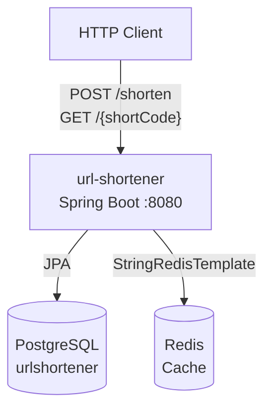

# url-shortener

A production-ready demo URL shortener service (similar to Bitly) built with Spring Boot 3.2.5 and Java 21. Designed to handle approximately 1 million users at scale through a Redis read cache layered in front of a PostgreSQL persistent store.

---

## Features

- Shorten any valid URL to a compact Base62-encoded short code
- Optional custom alias (e.g., `/my-link`)
- Optional expiration time per URL
- HTTP 302 redirect on resolution
- Cache-aside pattern with Redis for sub-millisecond redirect latency on hot paths
- Nightly scheduled job to purge expired URLs from PostgreSQL
- Structured JSON error responses for all failure cases
- Spring Actuator endpoints for production health monitoring

---

## Technology stack

| Layer | Technology |
|---|---|
| Runtime | Java 21 |
| Framework | Spring Boot 3.2.5 |
| Web | Spring MVC (embedded Tomcat) |
| Persistence | Spring Data JPA + Hibernate + PostgreSQL |
| Cache | Spring Data Redis (`StringRedisTemplate`) |
| Validation | Jakarta Bean Validation + Hibernate Validator |
| Build | Maven |
| Test | JUnit 5 + Mockito + AssertJ |
| Monitoring | Spring Actuator |

---

## Prerequisites

- Java 21+
- Maven 3.9+
- PostgreSQL 14+ (database: `urlshortener`)
- Redis 7+

---

## Quick start

**1. Start infrastructure**

```bash
# PostgreSQL
createdb urlshortener

# Redis (via Homebrew or Docker)
redis-server
# or
docker run -d -p 6379:6379 redis:7
```

**2. Configure (optional)**

Edit `src/main/resources/application.properties` to change the database credentials, base URL, or cleanup schedule.

**3. Run**

```bash
mvn spring-boot:run
```

The service starts on `http://localhost:8080`.

---

## API

### POST /shorten — Create a short URL

```bash
curl -X POST http://localhost:8080/shorten \
  -H "Content-Type: application/json" \
  -d '{
    "originalUrl": "https://example.com/some/very/long/path?query=value",
    "alias": "my-link",
    "expiresAt": "2026-12-31T23:59:59Z"
  }'
```

Both `alias` and `expiresAt` are optional. When `alias` is omitted, a short code is auto-generated from the record's database ID using Base62 encoding.

**Response (201 Created):**
```json
{
  "shortUrl":    "http://localhost:8080/my-link",
  "shortCode":   "my-link",
  "originalUrl": "https://example.com/some/very/long/path?query=value",
  "createdAt":   "2026-05-04T12:00:00Z",
  "expiresAt":   "2026-12-31T23:59:59Z"
}
```

**Error responses:**

| Status | Cause |
|---|---|
| `400 Bad Request` | Invalid URL, blank input, alias with disallowed characters |
| `409 Conflict` | Requested alias is already in use |

### GET /{shortCode} — Redirect to original URL

```bash
curl -L http://localhost:8080/my-link
```

Returns `302 Found` with the `Location` header set to the original URL.
Returns `404 Not Found` if the short code is unknown or has expired.

---

## Architecture



The redirect hot-path hits Redis first. On a cache miss the service queries PostgreSQL, checks expiry, re-populates the cache, and returns the URL. Full architecture details are in [docs/ARCHITECTURE.md](docs/ARCHITECTURE.md).

---

## Project structure

```
src/main/java/com/demo/urlshortener/
  UrlShortenerApplication.java     # Entry point
  controller/UrlController.java    # REST endpoints
  service/UrlService.java          # Business logic + cache-aside
  model/UrlMapping.java            # JPA entity
  repository/UrlRepository.java    # Spring Data JPA
  config/RedisConfig.java          # Redis CacheManager
  util/Base62Encoder.java          # ID -> short code
  scheduler/ExpirationCleanupJob.java  # Nightly cleanup
  dto/                             # Request/response DTOs
  exception/                       # Custom exceptions + global handler
```

---

## Testing

```bash
# Run all tests
mvn test

# Run a specific suite
mvn test -Dtest=UrlServiceTest
mvn test -Dtest=Base62EncoderTest
```

Tests use JUnit 5 + Mockito with no Spring context loaded. Coverage includes:
- URL shortening with and without custom alias
- Duplicate alias detection
- Redis cache hit (no database call)
- Redis cache miss with database fallback and cache population
- Expired URL handling
- Unknown short code handling
- Base62 encoding correctness and edge cases

---

## Monitoring

Spring Actuator endpoints are exposed on the same port (8080):

| Endpoint | Description |
|---|---|
| `GET /actuator/health` | Service, database, and Redis health |
| `GET /actuator/info` | Application metadata |
| `GET /actuator/metrics` | JVM, HTTP, datasource, and cache metrics |

---

## Documentation

| Document | Contents |
|---|---|
| [docs/ARCHITECTURE.md](docs/ARCHITECTURE.md) | Layer diagrams, components, DB schema, Redis model, configuration reference |
| [docs/FLOW.md](docs/FLOW.md) | Sequence diagrams for all request flows, cache-aside detail, cleanup job |
| [docs/DESIGN.md](docs/DESIGN.md) | Design decisions, trade-offs, design patterns, tech debt register |
| [docs/SECURITY.md](docs/SECURITY.md) | Security posture, input validation gaps, hardening checklist |
| [CLAUDE.md](CLAUDE.md) | AI agent guide: layout, build commands, API reference, implementation notes |

---

## Known limitations (demo caveats)

- No authentication — `POST /shorten` is publicly accessible
- Database credentials are hardcoded in `application.properties`
- `ddl-auto=update` is used instead of proper migration tooling (Flyway/Liquibase)
- No Redis memory limit configured — unbounded growth in production
- Short codes are sequentially predictable (Base62 of sequential DB IDs)
- Actuator endpoints are exposed on the public port

See [docs/DESIGN.md](docs/DESIGN.md) and [docs/SECURITY.md](docs/SECURITY.md) for the full tech debt register and hardening checklist.
