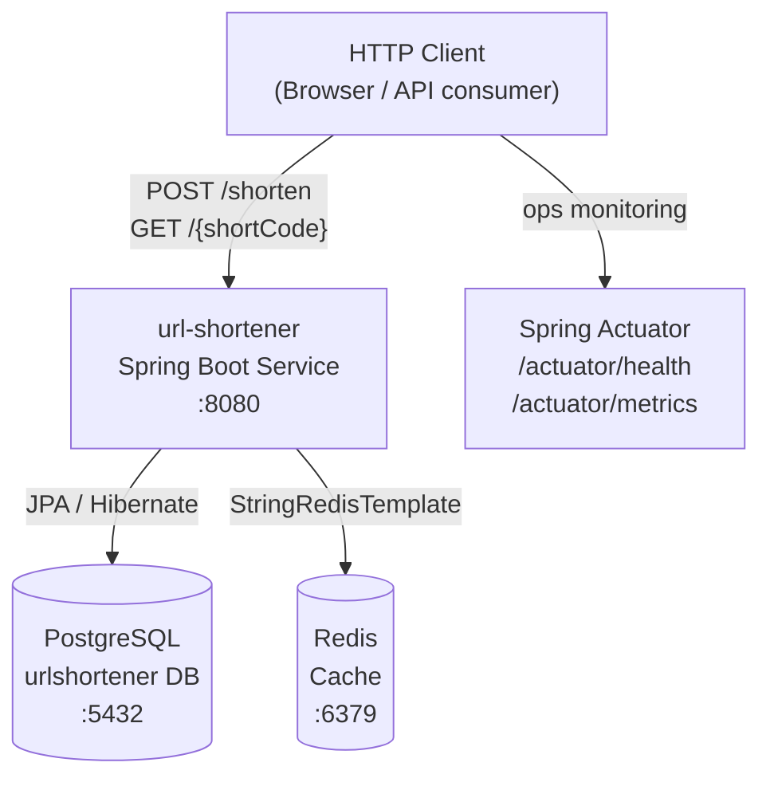
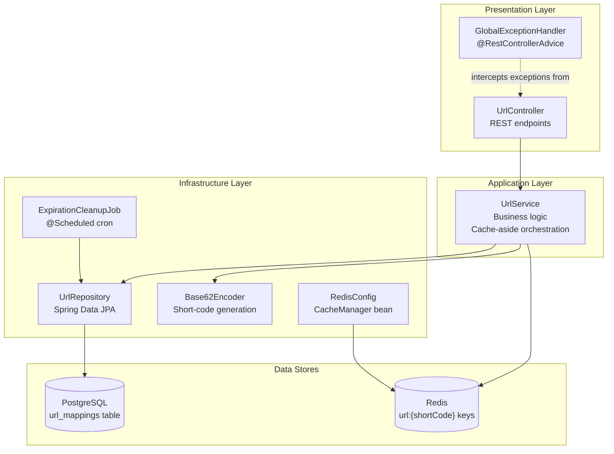

# Architecture

## Overview

`url-shortener` is a Spring Boot 3.2.5 / Java 21 service that converts long URLs into short codes and redirects visitors to the original destination. It is designed to operate at scale (~1 million users) by layering a Redis read-through cache in front of a PostgreSQL persistent store, keeping hot-path redirect latency in the single-digit millisecond range.

---

## System Context

---

## Layer Diagram

---

## Component Descriptions

| Component | Package | Responsibility |
|---|---|---|
| `UrlShortenerApplication` | root | Spring Boot entry point; enables `@EnableCaching` and `@EnableScheduling` |
| `UrlController` | controller | Exposes `POST /shorten` and `GET /{shortCode}`; delegates to `UrlService` |
| `UrlService` | service | Implements shorten and resolve logic; owns the cache-aside pattern via `StringRedisTemplate` |
| `UrlRepository` | repository | Spring Data JPA; provides `findByShortCode`, `existsByShortCode`, and bulk `deleteAllExpired` |
| `UrlMapping` | model | JPA entity mapped to `url_mappings`; contains expiry check logic (`isExpired()`) |
| `ShortenRequest` | dto | Bean-validated inbound payload; enforces URL format and alias character rules |
| `ShortenResponse` | dto | Outbound payload containing `shortUrl`, `shortCode`, `originalUrl`, timestamps |
| `Base62Encoder` | util | Encodes a positive `long` database ID into a Base62 string using alphabet `0-9a-zA-Z` |
| `RedisConfig` | config | Declares the `CacheManager` bean with 24-hour default TTL, JSON value serialization |
| `ExpirationCleanupJob` | scheduler | Cron job (default 03:00 daily) that bulk-deletes expired rows from PostgreSQL |
| `GlobalExceptionHandler` | exception | Translates `UrlNotFoundException` (404), `AliasAlreadyExistsException` (409), validation errors (400), and generic exceptions (500) into structured JSON |
| `UrlNotFoundException` | exception | Thrown when a short code does not exist or has expired |
| `AliasAlreadyExistsException` | exception | Thrown when a requested custom alias is already registered |

---

## Database Schema

### Table: `url_mappings`

| Column | Type | Constraints |
|---|---|---|
| `id` | BIGINT | PK, auto-increment |
| `short_code` | VARCHAR(20) | NOT NULL, UNIQUE |
| `original_url` | VARCHAR(2048) | NOT NULL |
| `created_at` | TIMESTAMPTZ | NOT NULL, set by `@PrePersist` |
| `expires_at` | TIMESTAMPTZ | nullable |

Index: `idx_short_code` (unique) on `short_code`.

Schema is managed by `spring.jpa.hibernate.ddl-auto=update`.

---

## Redis Data Model

Keys follow the pattern `url:{shortCode}` (e.g., `url:abc123`).
Values are the raw original URL string.

TTL strategy:
- URL with expiry: TTL = `expiresAt - now` (skipped entirely when already elapsed)
- URL without expiry: fixed 24-hour TTL

The `CacheManager` bean in `RedisConfig` provides a secondary Spring Cache abstraction layer (unused directly by `UrlService`, which drives Redis imperatively via `StringRedisTemplate`).

---

## External Integrations

| Integration | Technology | Usage |
|---|---|---|
| PostgreSQL | Spring Data JPA / Hibernate | Persistent storage of all URL mappings |
| Redis | Spring Data Redis (`StringRedisTemplate`) | Read cache for redirect hot-path |
| Spring Actuator | `spring-boot-starter-actuator` | Exposes `/actuator/health`, `/actuator/info`, `/actuator/metrics` |

---

## Configuration Reference

All configuration lives in `src/main/resources/application.properties`.

| Property | Default | Description |
|---|---|---|
| `app.base-url` | `http://localhost:8080` | Prefix prepended to short codes in responses |
| `app.cleanup.cron` | `0 0 3 * * *` | Cron expression for the expiry cleanup job |
| `server.port` | `8080` | HTTP listen port |
| `spring.datasource.url` | `jdbc:postgresql://localhost:5432/urlshortener` | PostgreSQL JDBC URL |
| `spring.datasource.username` | `postgres` | Database username |
| `spring.datasource.password` | `postgres` | Database password |
| `spring.jpa.hibernate.ddl-auto` | `update` | Schema management strategy |
| `spring.data.redis.host` | `localhost` | Redis hostname |
| `spring.data.redis.port` | `6379` | Redis port |
| `management.endpoints.web.exposure.include` | `health,info,metrics` | Actuator endpoints exposed over HTTP |
| `management.endpoint.health.show-details` | `always` | Full health detail shown in responses |
