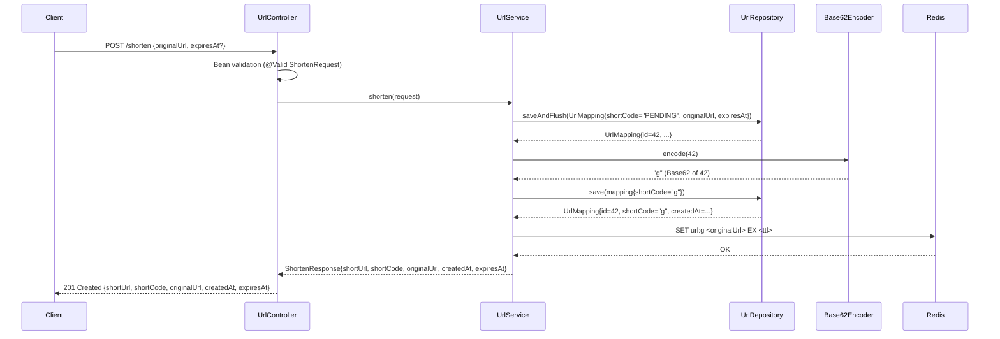
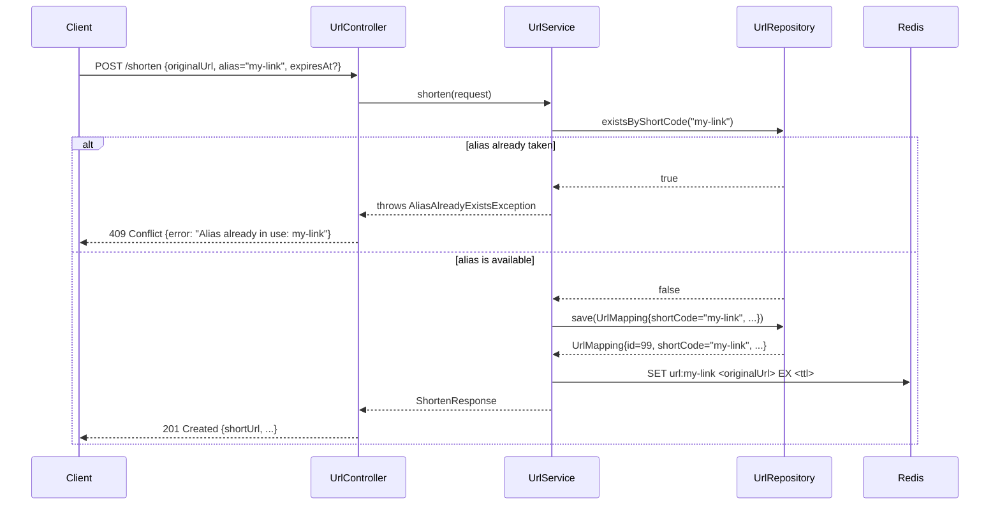
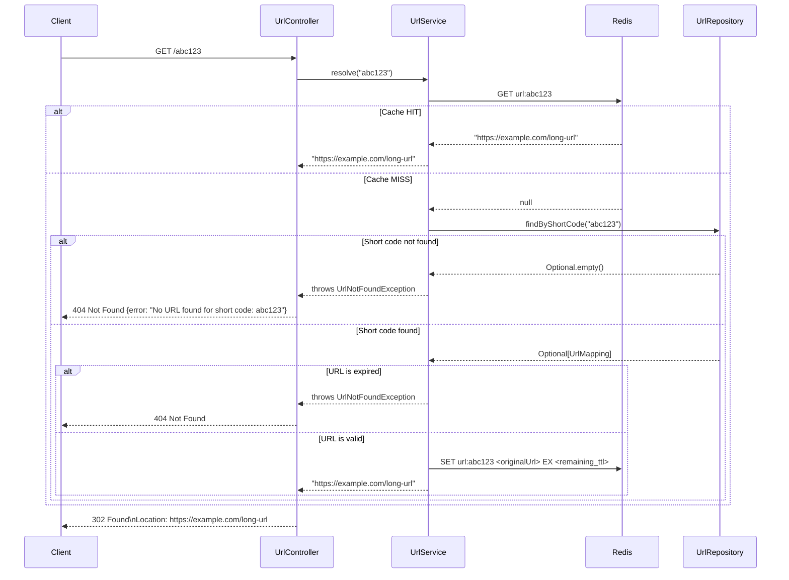
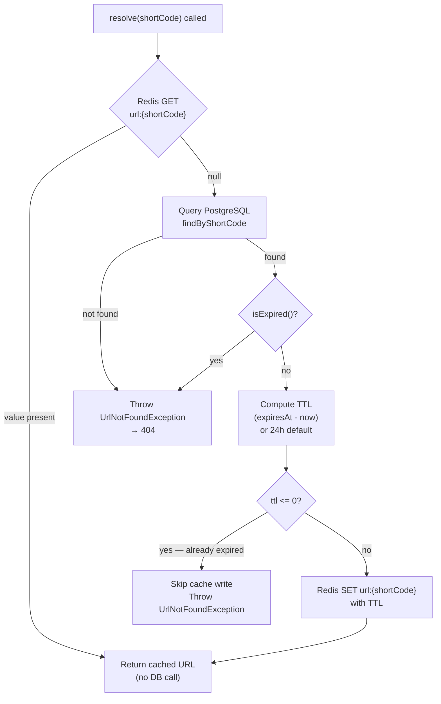
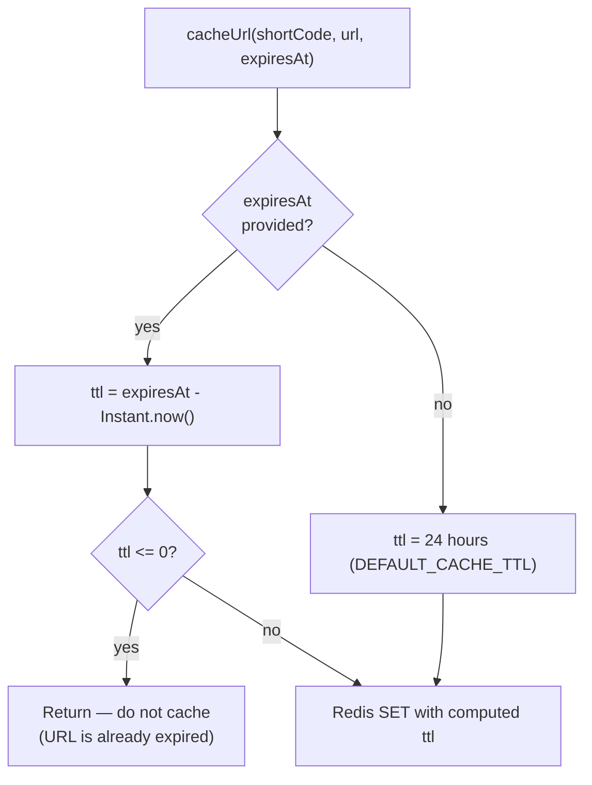
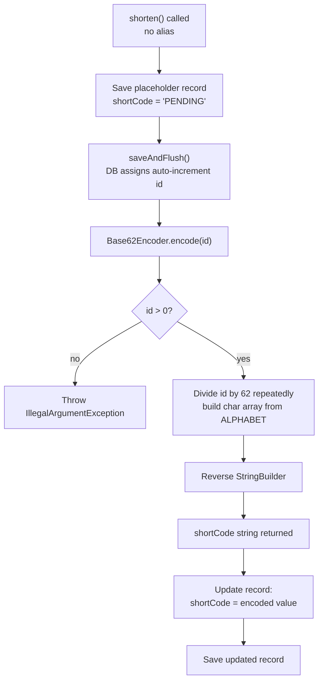
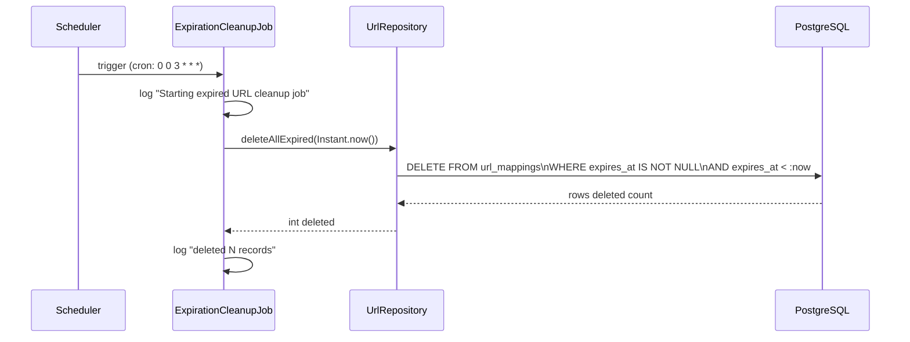
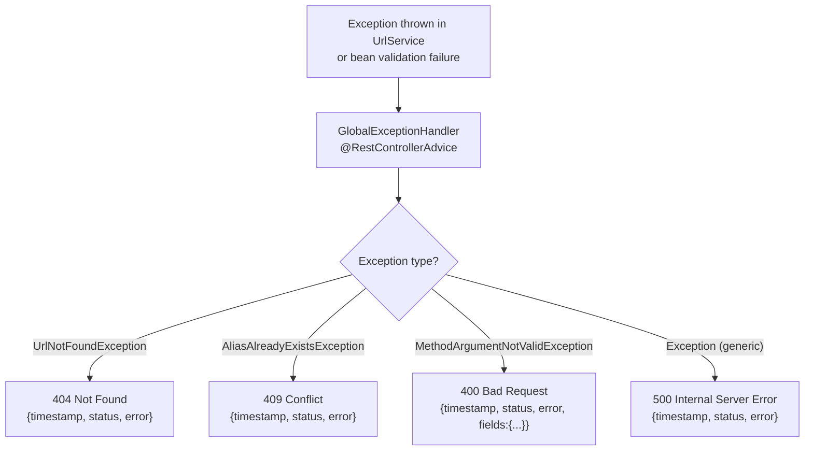
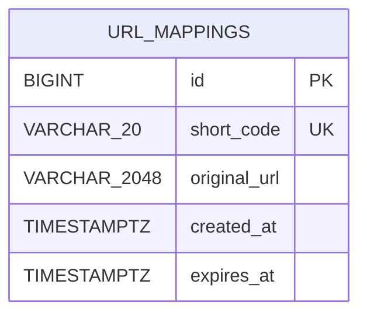

# Data Flow

## Overview

This document describes the request/response flows, cache interaction patterns, and background job behavior of the `url-shortener` service.

---

## 1. URL Shortening Flow — POST /shorten

### 1a. Auto-generated short code (no alias provided)

### 1b. Custom alias provided

---

## 2. Redirect Flow — GET /{shortCode}

---

## 3. Cache-Aside Pattern Detail

---

## 4. TTL Computation Logic

---

## 5. Short Code Generation

Base62 alphabet: `0123456789abcdefghijklmnopqrstuvwxyzABCDEFGHIJKLMNOPQRSTUVWXYZ`

Capacity by code length:

| Length | Unique codes |
|---|---|
| 1 | 62 |
| 2 | 3,844 |
| 4 | ~14.8 million |
| 6 | ~56 billion |
| 7 | ~3.5 trillion |

Because IDs are sequential database integers, the encoded codes are also monotonically increasing in lexicographic order for the same length.

---

## 6. Expiration Cleanup Job

Note: the cleanup job removes rows from PostgreSQL but does **not** evict corresponding keys from Redis. Stale Redis keys expire naturally via their TTL. This is safe because `UrlService.resolve()` also checks `isExpired()` at read time before re-caching.

---

## 7. Error Response Flow

---

## 8. Data Model

The service uses a single table. There are no foreign keys or joins; the `short_code` unique index is the only secondary access path.
